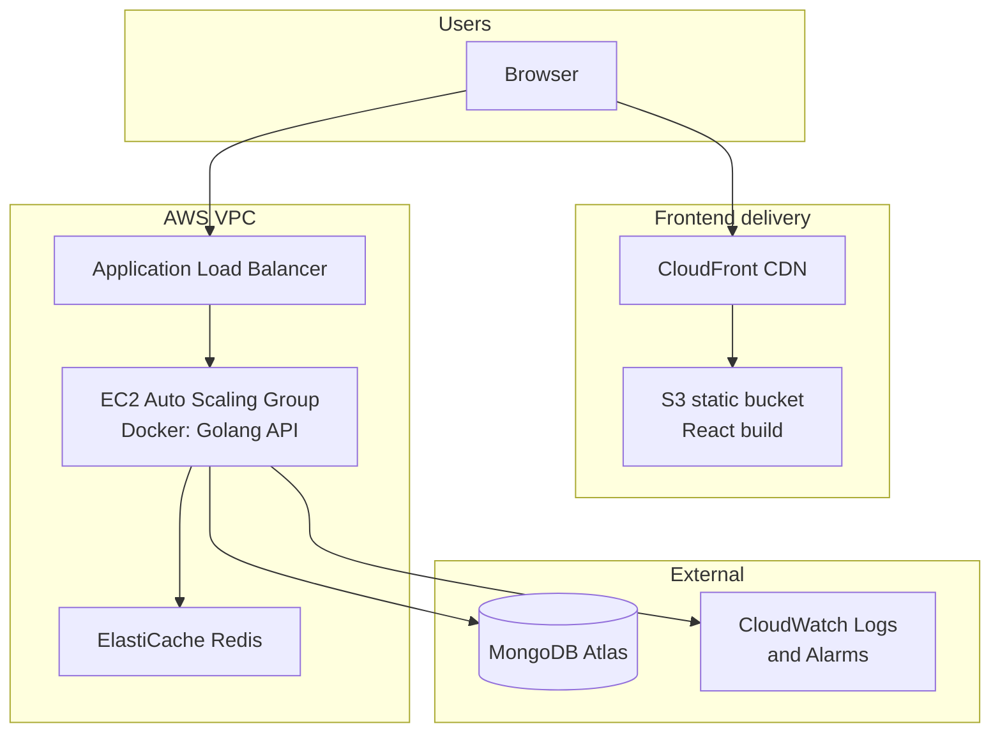

# StartTech System Architecture

## Overview

StartTech is a full-stack todo application deployed on AWS with CI/CD from GitHub Actions. Infrastructure is managed by Terraform; application code lives in a separate repository.

## Architecture diagram

## Components

| Layer | Technology | Purpose |
|-------|------------|---------|
| Frontend | React (Vite) | SPA served from S3 via CloudFront |
| Backend | Golang (Gin) | REST API on port 8080 |
| Load balancing | ALB + target group | Health check `/health`, routes HTTP to EC2 |
| Compute | ASG (t3.micro) | 1–3 instances, CPU target-tracking scaling |
| Cache | ElastiCache Redis 7 | Sessions/cache when `ENABLE_CACHE=true` |
| Database | MongoDB Atlas | Primary data store |
| Registry | ECR | Backend Docker images |
| Deploy | SSM Run Command | Rolling deploy per instance |
| State | S3 backend | Terraform remote state for CI and local |
| Monitoring | CloudWatch | Log groups, dashboard, metric alarms |

## Network security

- **Public subnets:** ALB only (80/443 from internet).
- **Private subnets:** EC2 and Redis.
- **EC2 security group:** Port 8080 from ALB only.
- **Redis security group:** Port 6379 from EC2 only.
- **S3:** Private; CloudFront OAC for read access.

## CI/CD

| Repository | Pipeline | Trigger |
|------------|----------|---------|
| `starttech-infra` | Terraform plan/apply | Push to `terraform/` |
| `starttech-application` | Frontend → S3 + invalidation | Push to `frontend/` |
| `starttech-application` | Backend → ECR → SSM rolling deploy | Push to `backend/` |

## Key endpoints

Outputs from `terraform output`:

- `alb_dns_name` — API base URL
- `cloudfront_domain_name` — frontend URL
- `redis_primary_endpoint` — Redis host
- `ecr_repository_url` — Docker push target

## Secrets

- **Terraform / AWS:** IAM access keys in GitHub Secrets (both repos).
- **Application:** `MONGO_URI`, `JWT_SECRET_KEY` in GitHub Secrets (`starttech-application` only).
- Never commit `terraform.tfvars`, `.env`, or credential files.
